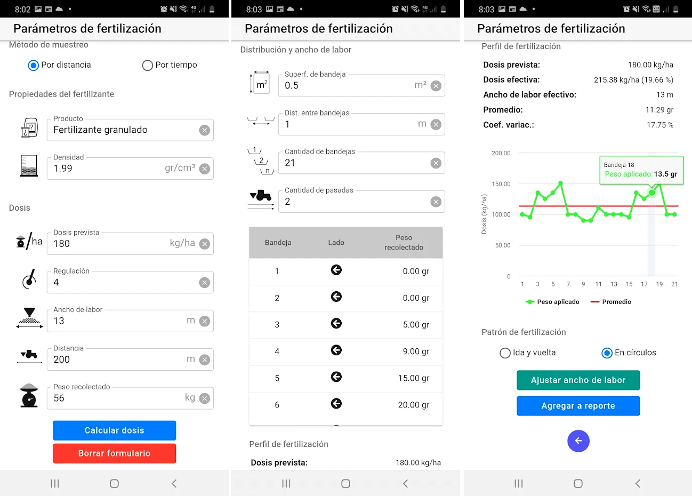

# Campero fertilizadoras

Una app para regular distribuidoras de cualquier tipo de producto por proyección como fertilizantes, abonos o enmiendas. Entre sus principales utilidades se encuentra un calculador de dosis y las herramientas de cálculo necesarias para determinar el ancho de labor del equipo y el grado de uniformidad de esa distribución.
Cuenta con un calculador de insumos que permite determinar la cantidad de producto a granel o en envases necesarios para el tratamiento de una determinada superficie.  
Los resultados obtenidos pueden ser compilados en un reporte que se almacena en el dispositivo y puede ser compartido por mail o redes sociales.


## Capturas de pantalla



## Instalación y despliegue

Descargar codigo fuente e instalar dependencias
```bash
$ git clone https://github.com/matiasmicheletto/camperofertilizadoras
$ cd camperofertilizadoras
$ npm install
```

Correr versión web para debug
```bash
$ npm run dev
```

Compilar versión web optimizada
```bash
$ npm run build
```


Compilar apk (android)
```bash
$ npm run build && npx cap sync
$ npx cap open android
$ adb logcat chromium:I
```

Lo anterior puede requerir variables de entorno:
```bash
export CAPACITOR_ANDROID_STUDIO_PATH="..../android-studio/bin/studio.sh"
export PATH=~/.npm-global/bin:$PATH  
```


Compilar release apk (android)
```bash
cd android && 
./gradlew assembleRelease && 
cd app/build/outputs/apk/release &&
jarsigner -keystore $KEYSTORE_PATH -storepass $KEYSTORE_PASS app-release-unsigned.apk $KEYSTORE_ALIAS && 
zipalign 4 app-release-unsigned.apk app-release.apk
```

Para compilar extension auravant, agregar el siguiente tag dentro del ```<head>``` de index.html
```html
<script src="https://auraview.auravant.com/sdk/v1.0/aura-package_v1.0.js"></script>
``` 

### Backlog

  - Seccion control:  
    - [x] Selección de variable de muestreo.  
    - [x] Calculo de la velocidad de avance.  
    - [x] Control de dosificación.  
    - [x] Calculo de resultados de medicion.  
    - [x] Inputs control de distribución.  
    - [x] Graficar muestreo de bandejas.  
    - [ ] Detectar tipo de perfil medido (?).  
    - [ ] Sugerir correcciones sobre el perfil medido.  
    - [x] Computar perfil aplicacion en funcion del ancho de labor.  
    - [x] Agregar datos al reporte actual.  
  - Sección insumos:  
    - [x] Calcular insumos en fc. de la superficie de trabajo.  
    - [x] Agregar insumos al reporte actual.  
  - Sección reportes:  
    - [x] Implementar modelo de reportes (basado en campero siembra).  
    - [x] Agregar datos a reportes (mostrar en sidepanel).  
    - [x] Listar reportes guardados.  
    - [x] Abrir reportes.  
    - [x] Editar/borrar reportes.  
    - [x] Exportar reportes a pdf.  
